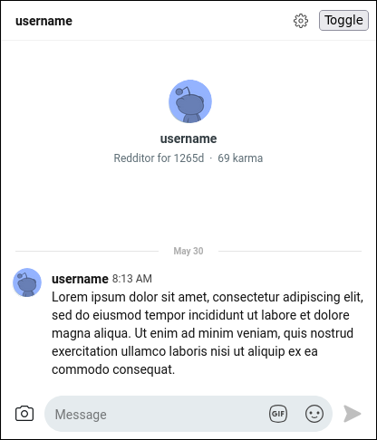
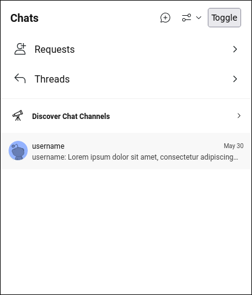

# Reddit Mobile Chat Fix

> [!NOTE]
> Reddit has suddenly updated the chat for mobile browsers. While I personally find it slower compared to my extension, you may no longer need it 😁

Just a glorified version of
[my user script](https://gist.github.com/nuckle/92100273f64a8d18d0010082fff0b587)
to make reddit chats usable in browser.

As a bonus, now you don't need to switch your user agent just to visit the site
on mobile!

## Preview

<details>
  <summary>Without the extension</summary>
  
  
</details>

<details>
  <summary>With the extension</summary>
  
  
</details>

## Download

| Firefox | Chrome |
|---------|--------|
| <p align="center"><a href="https://addons.mozilla.org/en-US/firefox/addon/reddit-mobile-chat-fix/"></a></p> | <p align="center"><a href="https://chromewebstore.google.com/detail/reddit-mobile-chat-fix/jbjedfodniecglfmkmpapajikdacieeo"></a></p> |
| [Download](https://addons.mozilla.org/en-US/firefox/addon/reddit-mobile-chat-fix/) | [Download](https://chromewebstore.google.com/detail/reddit-mobile-chat-fix/jbjedfodniecglfmkmpapajikdacieeo) |


Or on a [release page](https://github.com/nuckle/reddit-chat-mobile-fix/releases/latest)

## Features

- DMs support
- Threads support
- Built-in user-agent spoofer
- Basic chat functionality support

## Permissions

- `scripting`: For JavaScript code injection. Also Reddit chat uses shadow DOM and React a lot, so injection is the only option in this case
- `storage`: To store user settings 
- `declarativeNetRequest`: Used in ManifestV3 for creating network rules (user-agent spoofer)
- `webRequest`, `webRequestBlocking`: Used in ManifestV2 for user-agent spoofing

## Usage Notes

The extension manifest is defined in `src/manifest.js` and used by
`@samrum/vite-plugin-web-extension` in the vite config.

Background, content scripts, options, and popup entry points exist in the
`src/entries` directory.

To switch between Manifest V2 and Manifest V3 builds, use the MANIFEST_VERSION
environment variable defined in `.env`

HMR during development in Manifest V3 requires Chromium version >= 110.0.5480.0.

## Customize configuration

See [Vite Configuration Reference](https://vitejs.dev/config/).

## Project Setup

```sh
npm install
```

You can customize your build via `.env` file

```conf
MANIFEST_VERSION=3
FIREFOX_BUILD=0
```
- `MANIFEST_VERSION` - manifest version you want to use (`2` or `3`)
- `FIREFOX_BUILD` - is the build for Firefox (`0` - no, `1` - yes)

## Commands

### Build

#### Development, HMR

Hot Module Reloading is used to load changes inline without requiring extension
rebuilds and extension/page reloads Currently only works in Chromium based
browsers.

```sh
npm run dev
```

#### Development, Watch

Rebuilds extension on file changes. Requires a reload of the extension (and page
reload if using content scripts)

```sh
npm run watch
```

#### Production

Minifies and optimizes extension build

```sh
npm run build
```

Browser-specific builds

```sh
npm run build:chrome
# or
npm run build:firefox
```

The build will be at `dist/` directory

**Note:** Chrome build will use `v3` manifest and Firefox build will use `v2`
manifest. Also I added a random id for Firefox build to be able to install it
without any additional steps.

### Load extension in browser

Loads the contents of the dist directory into the specified browser

```sh
npm run serve:chrome
```

```sh
npm run serve:firefox
```

## License

This project uses AGPL license: [License](LICENSE)
